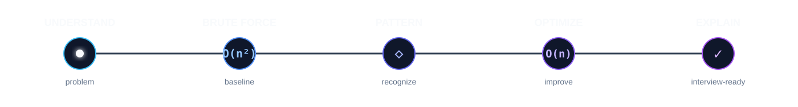

 

 

 

  <b>Computer Science Engineering Student • Software & Backend Engineering</b>

  Building software with a focus on understanding the engineering behind it.

 

  
  
  
  

## 👩‍💻 About

I'm a Computer Science Engineering student focused on **Java, backend engineering, full-stack development, and AI-powered software**.

I enjoy building applications, but I'm increasingly interested in what happens **behind the feature** — architecture, APIs, data flow, maintainability, performance, and the engineering decisions that make software reliable.

## Selected Work

### CodeMentor AI

**AI-Powered DSA Learning Platform**

> A system designed to help developers **understand coding problems**, rather than simply generating solutions.

`React` • `Node.js` • `Express.js` • `REST APIs` • `LLM Integration`

**Flow**

`Problem Understanding → Approaches → Optimization → Dry Run → Complexity → Debugging`

**Engineering focus**

`Layered Architecture` • `API Design` • `Prompt Orchestration` • `Error Handling` • `Frontend/Backend Separation`

<!-- 
  -->

 

## Algorithmic Problem Solving

### <strong>250+ LeetCode • 150+ GFG • 700+ DSA Commits</strong>

 

### Core Patterns

  
  
  
  

  
  
  
  

  
  
  
  

 

### How I Solve

  

> **Solve it → understand it → recognize it → explain it.**

 

---

## Stack

<b>Languages</b>
  

 

<b>Frontend & Backend</b>
  

 

<b>Data & Developer Tools</b>
  

 

<b>Currently Exploring</b>
  

 

## Engineering Direction

> ### Moving from **“Can I build this?”** toward **“Why should it be designed this way?”**

I'm deliberately learning to think beyond features and consider:

`Architecture` • `Separation of Concerns` • `API Design` • `Data Flow` • `Maintainability` • `Testing` • `Scalability`

 

## Contact

I'm always interested in conversations around:

**Software Engineering • Java • Backend Development • DSA • System Design • AI-Powered Products**

 

---

### `BUILD` → `UNDERSTAND` → `ENGINEER` → `IMPROVE`

**Learning to build systems, not just features.**

