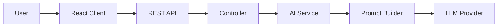
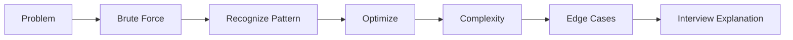
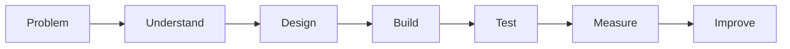

<div align="center">

# PARNEET KAUR

### Computer Science Engineering Student

**Java • Backend Engineering • Full Stack • AI**

Building software with a focus on understanding the engineering behind it.

<br/>

</div>

<p align="center">
  
  
  
  
  
</p>

<br/>
---
<table align="center">
  <tr>
    <td align="center">
      <strong>700+</strong><br/>
      DSA Commits
    </td>
    <td align="center">
      <strong>Java</strong><br/>
      Core Language
    </td>
    <td align="center">
      <strong>CodeMentor AI</strong><br/>
      Currently Building
    </td>
    <td align="center">
      <strong>Backend</strong><br/>
      Engineering Focus
    </td>
  </tr>
</table>

<br/>

## ⚡ Engineering Snapshot

|                                |                                                           |
| ------------------------------ | --------------------------------------------------------- |
| 🔨 **Currently Building**      | **CodeMentor AI** — AI-powered DSA learning platform      |
| 🧠 **Problem Solving**         | 700+ GitHub commits across interview-focused DSA problems |
| ☕ **Core Direction**           | Java • Backend Engineering • Full-Stack Development       |
| ⚙️ **Building With**           | React • Node.js • Express.js • REST APIs                  |
| 🤖 **Interested In**           | AI-powered applications • AI/ML integration               |
| 🏗️ **Currently Growing Into** | Spring Boot • Docker • Redis • System Design              |

---

## 👩‍💻 About Me

I'm a Computer Science Engineering student focused on **Java, backend engineering, full-stack development, and AI-powered software**.

I enjoy building applications, but I'm increasingly interested in what happens **behind the feature** — architecture, APIs, data flow, maintainability, performance, and the engineering decisions that make software reliable.

<table>
  <tr>
    <td>🔨 <b>Building</b></td>
    <td>CodeMentor AI</td>
  </tr>
  <tr>
    <td>☕ <b>Core Focus</b></td>
    <td>Java • Backend Engineering</td>
  </tr>
  <tr>
    <td>🧠 <b>Problem Solving</b></td>
    <td>DSA • Interview Patterns</td>
  </tr>
  <tr>
    <td>🏗️ <b>Exploring</b></td>
    <td>Spring Boot • Docker • Redis • System Design</td>
  </tr>
</table>


# 🚀 Featured Engineering Work

## 🤖 CodeMentor AI
### AI-Powered DSA Learning Platform

> A system designed to help developers **understand coding problems**, rather than simply generating solutions.

`React` • `Node.js` • `Express.js` • `REST APIs` • `LLM Integration`

### What It Does

**Problem Understanding → Approaches → Optimization → Dry Run → Complexity → Debugging**

### Engineering Focus

`Layered Architecture` • `API Design` • `Prompt Orchestration` • `Error Handling` • `Frontend/Backend Separation`

### Tech

`React` • `JavaScript` • `Node.js` • `Express.js` • `REST APIs` • `AI APIs`

### System Flow



### What I'm learning through this project

`Frontend–Backend Separation`
`REST API Design`
`Service Architecture`
`Prompt Engineering`
`Error Handling`
`AI Integration`

➡️ **[Explore CodeMentor AI](https://github.com/Parneetk104/Codementor-ai)**

---

# 🧠 Algorithmic Problem Solving

<div align="center">

## 700+ Repository Commits

**Java • Pattern Recognition • Interview Preparation**

</div>

| Pattern | Focus |
|---|---|
| Arrays & Strings | Foundations and problem decomposition |
| Two Pointers | Pointer movement and invariants |
| Sliding Window | Fixed and variable windows |
| Binary Search | Arrays and answer-space search |
| Linked Lists | Pointer manipulation |
| Stack & Queue | Simulation and monotonic patterns |
| Trees | Recursion, DFS and BFS |
| Heaps | Priority-based problems |
| Greedy | Local decision strategies |
| Backtracking | State-space exploration |

### My Problem-Solving Process




➡️ **[Explore My DSA Journey](https://github.com/Parneetk104/Dsa-LeetCode)**

---

# 🐧 Linux & Developer Foundations

I'm also documenting my Linux learning journey to strengthen the developer fundamentals behind backend engineering and software development.

### Areas I'm exploring

`Linux Commands` • `Bash` • `Shell` • `Processes` • `Permissions` • `Environment` • `Developer Tooling`

➡️ **[Explore Linux Mastery Journey](https://github.com/Parneetk104/linux-mastery-journey)**

---

# 🛠️ Technical Toolkit

### Core Languages
`Java` `JavaScript` `Python` `SQL`

### Frontend
`React` `Vite` `Tailwind CSS` `HTML` `CSS`

### Backend
`Node.js` `Express.js` `REST APIs`

### Data
`MongoDB` `PostgreSQL`

### Engineering Tools
`Git` `GitHub` `Postman` `Linux`

### Currently Learning
`Spring Boot` `Docker` `Redis` `System Design` `AI/ML`

---

# 🏗️ Engineering Mindset



> ### Moving from **“Can I build this?”** toward **“Why should it be designed this way?”**

I'm deliberately learning to think beyond features and consider:

`Architecture` • `Separation of Concerns` • `API Design` • `Data Flow` • `Maintainability` • `Testing` • `Scalability`


# 🔍 What I Want My Projects to Prove

```text
Can I solve problems?
        ↓
Can I build features?
        ↓
Can I structure applications?
        ↓
Can I explain technical decisions?
        ↓
Can I improve the design?
```
---

# 🎯 Current Engineering Roadmap

### Strengthening

`Java`
`DSA`
`Backend Fundamentals`
`REST API Development`

### Building

`Full-Stack Applications`
`AI-Powered Software`
`Production-Style Projects`

### Learning Next

`Spring Boot`
`PostgreSQL in Depth`
`Docker`
`Redis`
`Testing`
`System Design`

### Long-Term Direction

**Backend Engineering • Software Engineering • AI-Integrated Applications**

---

# 🤝 Let's Connect

I'm always interested in conversations around:

**Software Engineering • Java • Backend Development • DSA • System Design • AI-Powered Products**

Add your verified links here before publishing:

`LinkedIn` • `LeetCode` • `Portfolio` • `Resume`

---

<div align="center">

### Build → Understand → Engineer → Improve

**Learning to build systems, not just features.**

</div>
