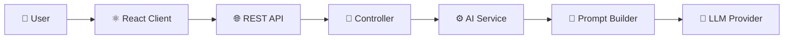
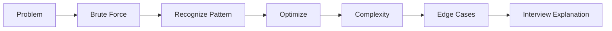
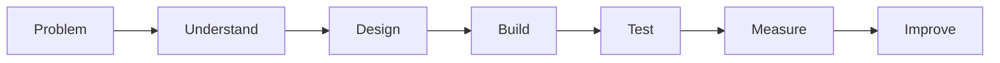

 

 

  <b>Computer Science Engineering Student • Software & Backend Engineering</b>

  Building software with a focus on understanding the engineering behind it.

  
  
  
  
  

 

<table align="center">
  <tr>
    <td align="center">
      <strong>700+</strong> 
      DSA Commits
    </td>
    <td align="center">
      <strong>Java</strong> 
      Core Language
    </td>
    <td align="center">
      <strong>CodeMentor AI</strong> 
      Currently Building
    </td>
    <td align="center">
      <strong>Backend</strong> 
      Engineering Focus
    </td>
  </tr>
</table>

 

## ⚡ Engineering Snapshot

|                                |                                                           |
| ------------------------------ | --------------------------------------------------------- |
| 🔨 **Currently Building**      | **CodeMentor AI** — AI-powered DSA learning platform      |
| 🧠 **Problem Solving**         | 700+ GitHub commits across interview-focused DSA problems |
| ☕ **Core Direction**           | Java • Backend Engineering • Full-Stack Development       |
| ⚙️ **Building With**           | React • Node.js • Express.js • REST APIs                  |
| 🤖 **Interested In**           | AI-powered applications • AI/ML integration               |
| 🏗️ **Currently Growing Into** | Spring Boot • Docker • Redis • System Design              |

---

## 👩‍💻 About Me

I'm a Computer Science Engineering student focused on **Java, backend engineering, full-stack development, and AI-powered software**.

I enjoy building applications, but I'm increasingly interested in what happens **behind the feature** — architecture, APIs, data flow, maintainability, performance, and the engineering decisions that make software reliable.

<table>
  <tr>
    <td>🔨 <b>Building</b></td>
    <td>CodeMentor AI</td>
  </tr>
  <tr>
    <td>☕ <b>Core Focus</b></td>
    <td>Java • Backend Engineering</td>
  </tr>
  <tr>
    <td>🧠 <b>Problem Solving</b></td>
    <td>DSA • Interview Patterns</td>
  </tr>
  <tr>
    <td>🏗️ <b>Exploring</b></td>
    <td>Spring Boot • Docker • Redis • System Design</td>
  </tr>
</table>

## 🏆 Highlights & Milestones

> **Consistent problem solving • Strong academics • Continuous engineering growth**

 

<table>
<tr>

<td align="center" width="25%">

### 🧩 250+

**LeetCode**

Problems & interview-focused DSA practice

</td>

<td align="center" width="25%">

### 💻 150+

**GeeksforGeeks**

Data structures, algorithms & problem solving

</td>

<td align="center" width="25%">

### 🎓 9.3

**CGPA**

Computer Science Engineering

</td>

<td align="center" width="25%">

### 🔥 700+

**DSA Commits**

Consistent Java DSA learning journey

</td>

</tr>
</table>

# 🚀 Featured Engineering Work

## 🤖 CodeMentor AI
### AI-Powered DSA Learning Platform

> A system designed to help developers **understand coding problems**, rather than simply generating solutions.

`React` • `Node.js` • `Express.js` • `REST APIs` • `LLM Integration`

### What It Does

**Problem Understanding → Approaches → Optimization → Dry Run → Complexity → Debugging**

### Engineering Focus

`Layered Architecture` • `API Design` • `Prompt Orchestration` • `Error Handling` • `Frontend/Backend Separation`

### Tech

`React` • `JavaScript` • `Node.js` • `Express.js` • `REST APIs` • `AI APIs`

### 🏗️ System Architecture

### What I'm learning through this project

`Frontend–Backend Separation`
`REST API Design`
`Service Architecture`
`Prompt Engineering`
`Error Handling`
`AI Integration`

---

# 🧠 Algorithmic Problem Solving

## 700+ Repository Commits

**Java • Pattern Recognition • Interview Preparation**

| Pattern | Focus |
|---|---|
| Arrays & Strings | Foundations and problem decomposition |
| Two Pointers | Pointer movement and invariants |
| Sliding Window | Fixed and variable windows |
| Binary Search | Arrays and answer-space search |
| Linked Lists | Pointer manipulation |
| Stack & Queue | Simulation and monotonic patterns |
| Trees | Recursion, DFS and BFS |
| Heaps | Priority-based problems |
| Greedy | Local decision strategies |
| Backtracking | State-space exploration |

### My Problem-Solving Process

> **Goal:** Don't just solve the problem — understand the pattern well enough to recognize and explain it again.

➡️ **[Explore My DSA Journey](https://github.com/Parneetk104/Dsa-LeetCode)**

---

# 🛠️ Technical Toolkit

### Core Languages
`Java` `JavaScript` `Python` `SQL`

### Frontend
`React` `Vite` `Tailwind CSS` `HTML` `CSS`

### Backend
`Node.js` `Express.js` `REST APIs`

### Data
`MongoDB` `PostgreSQL`

### Engineering Tools
`Git` `GitHub` `Postman` `Linux`

### Currently Learning
`Spring Boot` `Docker` `Redis` `System Design` `AI/ML`

---

# 🏗️ Engineering Mindset

> ### Moving from **“Can I build this?”** toward **“Why should it be designed this way?”**

I'm deliberately learning to think beyond features and consider:

`Architecture` • `Separation of Concerns` • `API Design` • `Data Flow` • `Maintainability` • `Testing` • `Scalability`

---

# 🎯 Engineering Roadmap

| Now | Next | Direction |
|---|---|---|
| Java | Spring Boot | Backend Engineering |
| DSA | Docker | Software Engineering |
| REST APIs | Redis | Scalable Systems |
| Full Stack | Testing | AI-Integrated Products |
| AI Integration | System Design | Production Engineering |

---

# 🤝 Let's Connect

I'm always interested in conversations around:

**Software Engineering • Java • Backend Development • DSA • System Design • AI-Powered Products**

 

---

### `BUILD` → `UNDERSTAND` → `ENGINEER` → `IMPROVE`

**Learning to build systems, not just features.**

